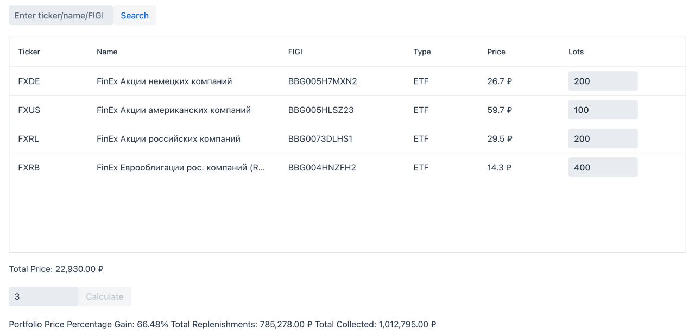

# Инвестиционный калькулятор
Создано в рамках [Tinkoff Invest Robot Contest](https://github.com/Tinkoff/invest-robot-contest)
## Идея
Одна из популярных стратегий на фондовом рынке - покупать акции/ETF в лонг, ежемесячно пополняя брокерский счет.
Однако, подсчитать доходность от такой стратегии зачастую бывает проблематично.

Для этого я сделал данный проект. Он позволяет собрать портфель из акций и ETF,
увидеть его стоимость и потенциальную доходность.

## Требования
- **JDK 17**
## Как собрать
- Добавить свой токен в `src/main/resources/application.yml`
- Запустить сборку `./gradlew assemble`
- Скопировать артефакт `build/libs/invest-0.1.0.jar` в удобное место
## Как запустить
Запустить `./java -jar invest-0.1.0.jar` в папке с артефактом.
## Как пользоваться
1. Ввести тикер/FIGI/имя акции/ETF и нажать кнопку "Search" - инструмент будет добавлен в таблицу.
2. Ввести количество лотов к покупке
3. Ввести количество лет и нажать кнопку "Calculate"

В результате будет информация по стоимости ежемесячной покупки, а также расчет доходности:
- Рост стоимости активов в процентах
- Суммарные пополнения
- Общая сумма на конец срока
